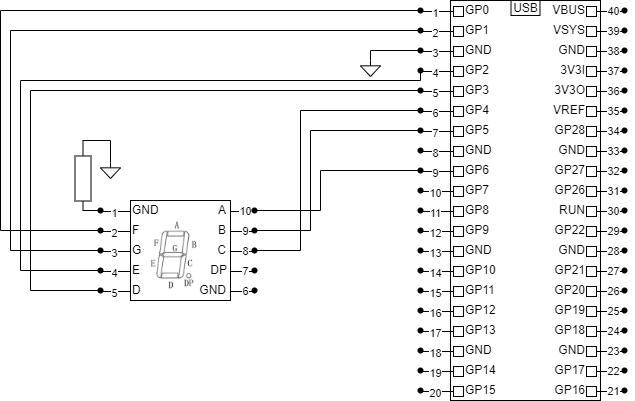

# Counter using 7-Segments Display
This is a very simple project created using a Raspberry Pi Pico board and a 3611AS LED 7-Segments Display. 
The display is connected to ground via a 330 ohms resistor (don't forget about this or your display may be damaged). 
The pins are connected in order to the Pico's GPIO pins, as indicated in the diagram (see below or the file diagram.png).

The "bin" folder contains pre-compiled .uf2 files for a "pico" (not "pico2", not "pico_w"), ready to be deployed on the board.
If you have a different board, you'll probably need to re-compile from source. 
The C source files can be compiled using Pico tools. I am using the Visual Studio Code extension. 

Video of building the circuit and running it:

More info and images on my website: https://computingmongoose.github.io/pico/counter7segments.html

## Official documentation
- SDK Setup (includes complete documentation): https://www.raspberrypi.com/documentation/microcontrollers/c_sdk.html
- Getting started with Raspberry Pi Pico (includes a guide on how to build and deploy programs): https://datasheets.raspberrypi.com/pico/getting-started-with-pico.pdf

